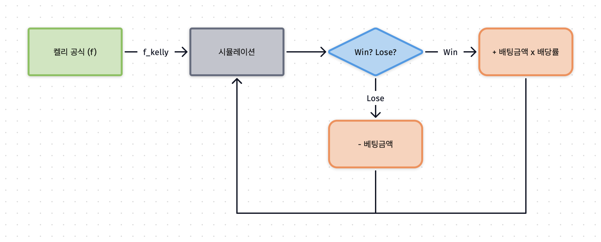
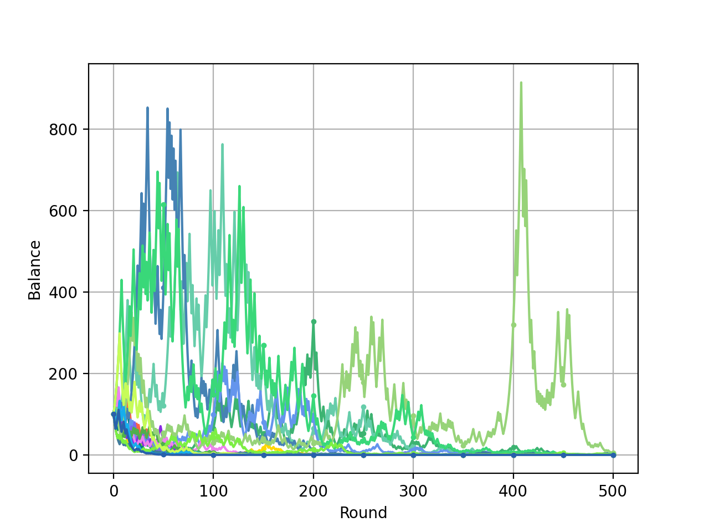
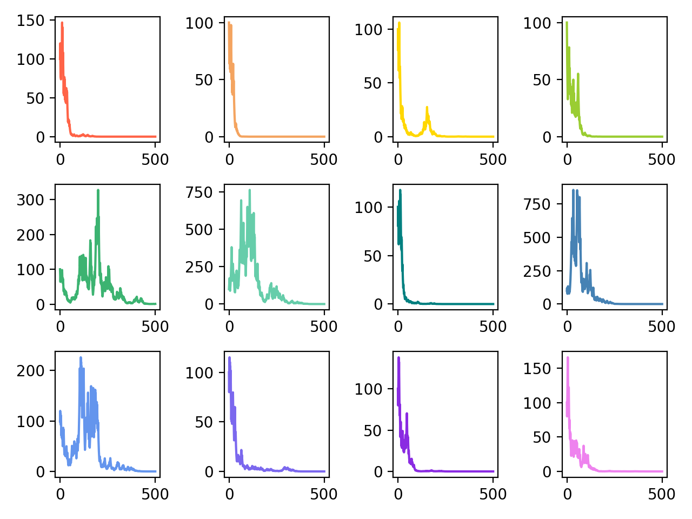
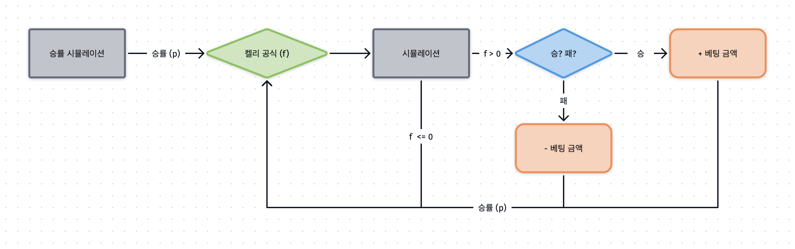
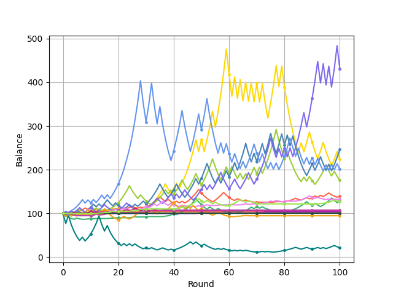
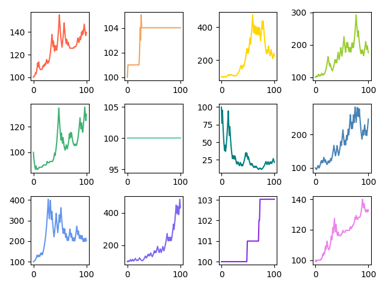

 
  <h3>심화주제탐구대회 자유주제 (2021)</h3>
  <h1>켈리 공식</h1>
  
  
  

### 대회 결과

> **고등학교 심화주제탐구대회 최우수상** (2021.07.14)

 

## 켈리 공식 (Kelly Criterion)

확률론과 시점간 선택(Intertemporal Choice)에서, **켈리 공식**(또는 켈리기준, 켈리전략, 켈리베팅)은 반복되는 일련의 베팅에서 최적 베팅 규모를 결정하는 공식이다. 벨 연구소의 연구원이었던 미국의 수학자 켈리(J.L. Kelly)가 1956년에 발표한 공식으로, 몇가지 가정이 단순화된 대부분의 도박/투자 상황에서 장기적으로 다른 어떤 전략보다 우월한 성과를 낸다.

[위키백과](https://ko.wikipedia.org/wiki/%EC%BC%88%EB%A6%AC_%EA%B3%B5%EC%8B%9D) • [realrain 블로그](https://realrain.net/post/kelly-criterion/)

 

## 시뮬레이션 결과
### Static Simulation (No Alg)

  

#### Result

  
  

---

### Kelly Simulation (With Alg)

  

#### Result

  
  

